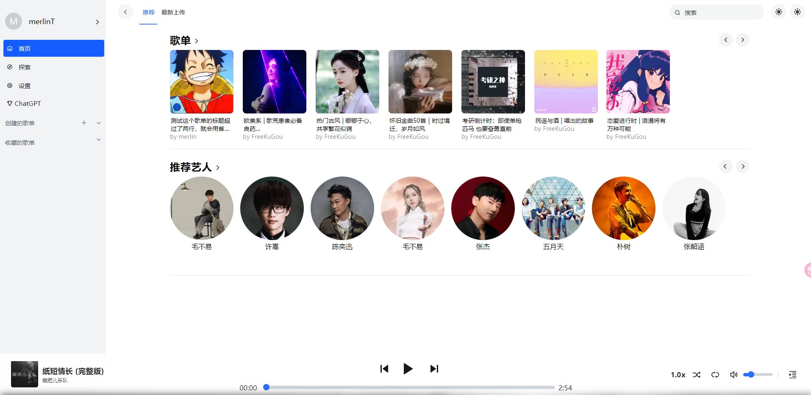
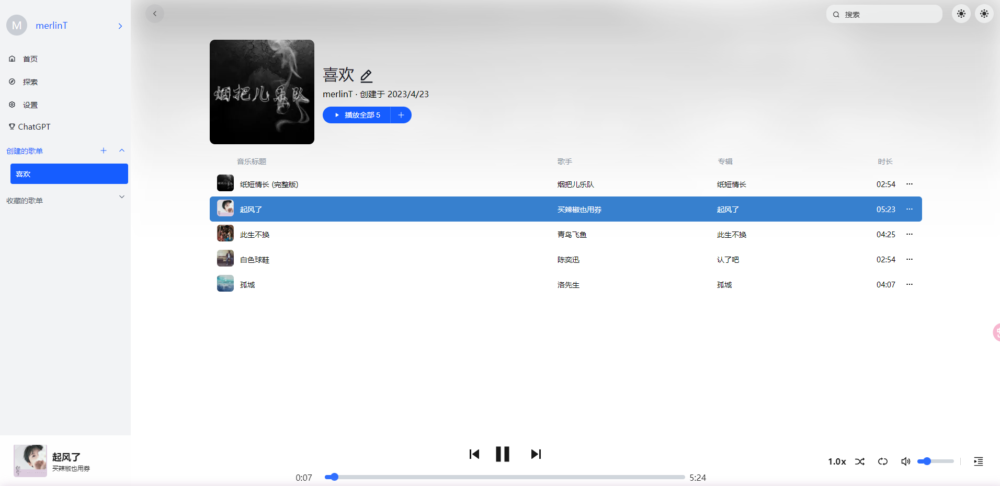

### web-music-player（网页版的音乐播放器）
做这个网页版的音乐播放器，本意是当作小 demo，为了练习和巩固 CSS、 JS。

完成的功能应该没有什么bug，但是因时间问题，还有部分的功能和优化还没做，一些浏览器兼容没有考虑。

欢迎大佬小佬们给建议！！


#### 效果图








#### 参考

- 学习项目

```
https://github.com/vikDang/Code_web_music_player
```

- 素材及设计

```
https://tools.liumingye.cn/music/
```


#### 收获

相对难点主要是音频播放和控制歌词滚动那部分，歌词滚动我主要想用 `transform:translateY`，所以会多一些考虑、难度。

布局和命名对我来说比较纠结和头疼...

在基本完成后，也会有小兴奋

总之，Go on


