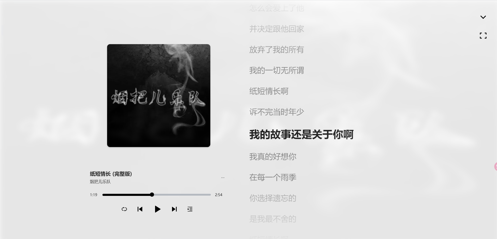

### web-music-player（网页版的音乐播放器）
做这个小 demo，是为了练手和巩固 CSS、 JS。

完成的功能应该没有什么bug，但是因时间问题，还有部分的功能和优化还没做，一些浏览器兼容没考虑。

欢迎大佬小佬们给建议！！


#### 效果图





#### 参考

- 学习项目

```
https://github.com/vikDang/Code_web_music_player
```

- 素材及设计

```
https://tools.liumingye.cn/music/
```


#### 收获

相对难点主要是音频播放和控制歌词滚动那部分，歌词滚动我主要想用 `transform:translateY`。

布局和命名也是比较纠结和头疼...

完成之后，还是有点小兴奋...

总之，Go on


